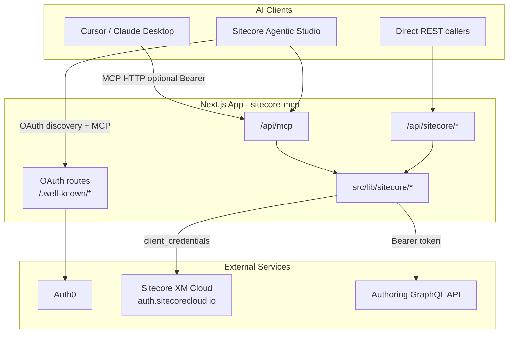
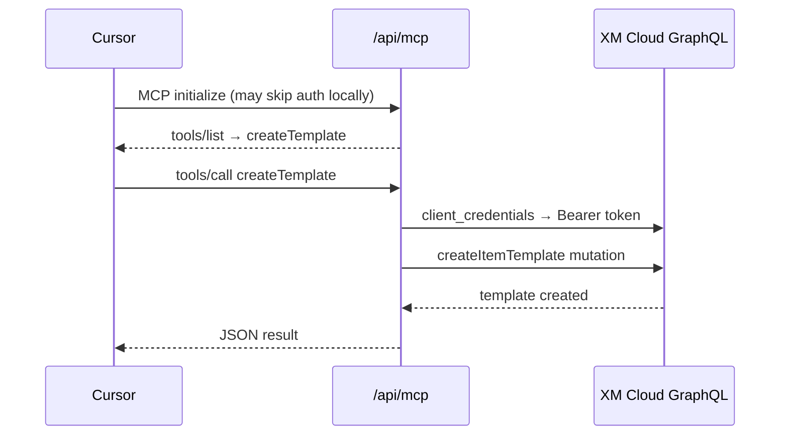
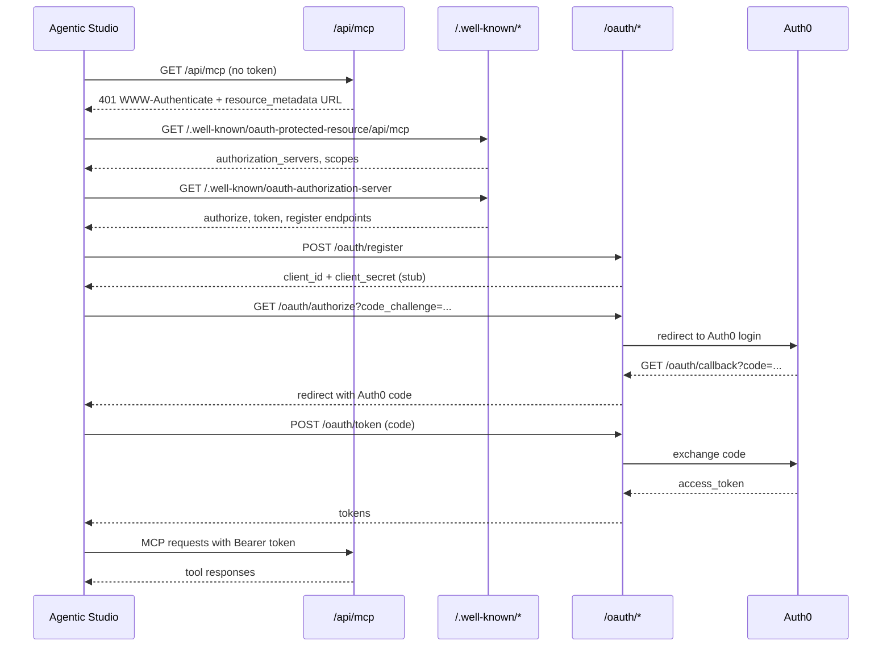
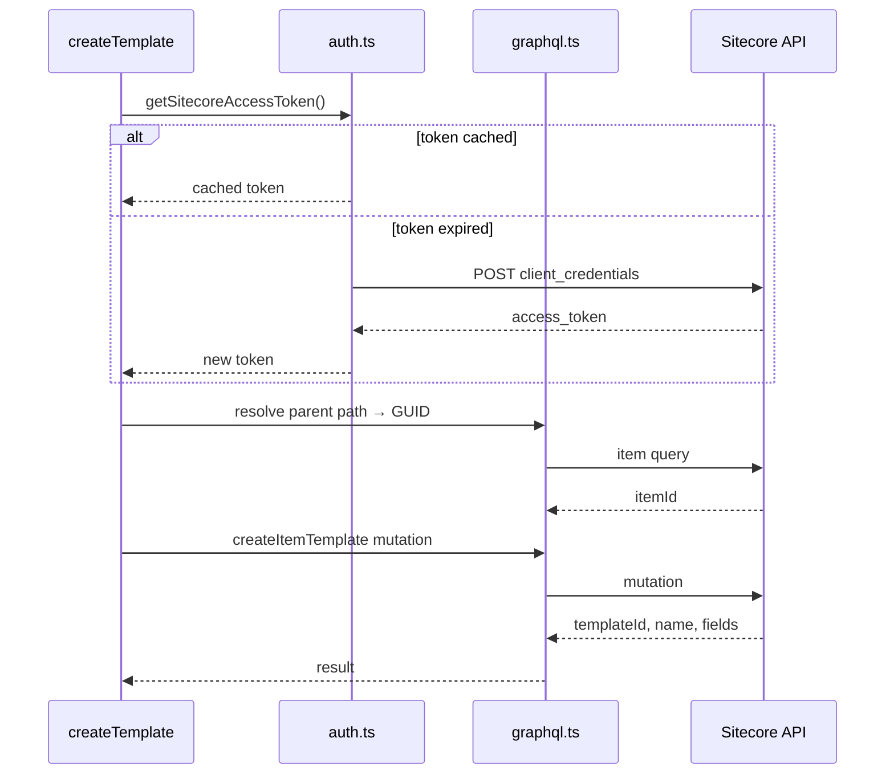

# Sitecore XM Cloud MCP Server — Complete Documentation

This repository is a **Next.js application** that exposes a **Model Context Protocol (MCP) server** for **Sitecore XM Cloud**. AI clients (Cursor, Sitecore Agentic Studio, Claude Desktop, etc.) can connect to it and invoke tools that perform Sitecore authoring operations — today, primarily **creating data templates** via the Sitecore Authoring GraphQL API.

The app is designed to run locally or on **Vercel**, and it implements the **OAuth discovery and proxy routes** required for **Sitecore Agentic Studio** to authenticate against the MCP endpoint.

---

## Table of Contents

1. [What problem does this solve?](#1-what-problem-does-this-solve)
2. [High-level architecture](#2-high-level-architecture)
3. [Two separate authentication systems](#3-two-separate-authentication-systems)
4. [Project structure](#4-project-structure)
5. [Route reference — what each endpoint does and why it exists](#5-route-reference--what-each-endpoint-does-and-why-it-exists)
6. [MCP tools](#6-mcp-tools)
7. [Core library modules](#7-core-library-modules)
8. [Environment variables](#8-environment-variables)
9. [Setup and running locally](#9-setup-and-running-locally)
10. [End-to-end flows](#10-end-to-end-flows)
11. [Usage examples](#11-usage-examples)
12. [Deployment notes](#12-deployment-notes)
13. [Known limitations and configuration gaps](#13-known-limitations-and-configuration-gaps)

---

## 1. What problem does this solve?

### Without this repo

- AI assistants have no native way to talk to Sitecore XM Cloud.
- Sitecore authoring operations (like creating templates) require authenticated GraphQL calls with XM Cloud Automation Client credentials.
- **Sitecore Agentic Studio** expects MCP servers to support **OAuth 2.0 protected resource discovery** — a standard way for clients to discover how to authenticate before calling `/api/mcp`.

### With this repo

| Capability | How |
|---|---|
| AI-driven Sitecore operations | MCP tool `createTemplate` wraps Sitecore GraphQL |
| XM Cloud authentication | Server-side client credentials flow, token cached |
| MCP over HTTP | `mcp-handler` provides Streamable HTTP + SSE transports |
| Sitecore Agentic Studio compatibility | OAuth discovery + proxy routes backed by Auth0 |
| Direct REST testing | `/api/sitecore/templates` and `/api/sitecore/token` |

In short: **this repo is a bridge between AI MCP clients and Sitecore XM Cloud**, with OAuth plumbing so enterprise Sitecore tools can connect securely.

---

## 2. High-level architecture



**Data flow for a template creation:**

1. MCP client calls `createTemplate` tool on `/api/mcp`.
2. MCP handler invokes `createSitecoreTemplate()` in the library layer.
3. Library obtains (or reuses cached) XM Cloud bearer token.
4. Library resolves parent folder path → GUID, then runs `createItemTemplate` GraphQL mutation.
5. Result is returned to the AI client as JSON text content.

---

## 3. Two separate authentication systems

This is the most important concept to understand. The repo uses **two independent auth flows** for two different purposes:

### A. Sitecore XM Cloud auth (server → Sitecore)

- **Who uses it:** The Next.js server itself, when calling Sitecore GraphQL.
- **How:** OAuth 2.0 `client_credentials` with an **XM Cloud Automation Client**.
- **Env vars:** `SITECORE_CLIENT_ID`, `SITECORE_CLIENT_SECRET`, `SITECORE_AUTHORING_ENDPOINT`
- **Token endpoint:** `https://auth.sitecorecloud.io/oauth/token`
- **Audience:** `https://api.sitecorecloud.io`
- **Implementation:** `src/lib/sitecore/auth.ts` — tokens are cached in memory until near expiry.

This auth is **never exposed to MCP clients**. The server holds Sitecore credentials and acts on behalf of the connected AI user.

### B. MCP client OAuth (client → this app)

- **Who uses it:** MCP clients like **Sitecore Agentic Studio** that require OAuth before accessing `/api/mcp`.
- **How:** OAuth 2.0 Authorization Code flow with PKCE, proxied through this app to **Auth0**.
- **Env vars:** `AUTH0_DOMAIN`, `AUTH0_AUDIENCE`, `AUTH0_WEB_CLIENT_ID`, `AUTH0_WEB_CLIENT_SECRET`, `MCP_BASE_URL`
- **Implementation:** OAuth routes under `/oauth/*` and `/.well-known/*`.

When a client hits `/api/mcp` without a `Bearer` token, `withMcpOAuthChallenge` returns **401 Unauthorized** with a `WWW-Authenticate` header pointing to resource metadata — this triggers the client's OAuth discovery flow.

> **Note:** The current OAuth middleware only checks that a Bearer token **is present**; it does not validate the JWT against Auth0. Full token verification would be a natural next hardening step.

---

## 4. Project structure

```
sitecore-mcp/
├── src/
│   ├── app/
│   │   ├── page.tsx                          # Landing page with setup hints
│   │   ├── layout.tsx                        # Root layout
│   │   ├── api/
│   │   │   ├── mcp/
│   │   │   │   ├── route.ts                  # Main MCP endpoint (auth-wrapped)
│   │   │   │   ├── mcpServer.ts              # MCP tool definitions
│   │   │   │   ├── sse/route.ts              # SSE transport (GET)
│   │   │   │   └── message/route.ts          # SSE message channel (POST)
│   │   │   └── sitecore/
│   │   │       ├── token/route.ts            # Debug: verify Sitecore auth
│   │   │       └── templates/route.ts        # REST alternative to MCP tool
│   │   ├── oauth/
│   │   │   ├── authorize/route.ts            # Start OAuth → redirect to Auth0
│   │   │   ├── callback/route.ts             # Auth0 callback → redirect to Sitecore
│   │   │   ├── token/route.ts                # Exchange code for Auth0 tokens
│   │   │   └── register/route.ts             # Dynamic client registration (stub)
│   │   └── .well-known/
│   │       ├── oauth-authorization-server/   # OAuth server metadata
│   │       └── oauth-protected-resource/     # Protected resource metadata
│   │           └── api/mcp/                  # Resource-specific metadata for MCP
│   └── lib/
│       └── sitecore/
│           ├── config.ts                     # Sitecore env config
│           ├── auth.ts                       # XM Cloud token acquisition + cache
│           ├── graphql.ts                    # GraphQL client with 401 retry
│           ├── createTemplate.ts             # Template creation business logic
│           ├── oauthMetadata.ts              # OAuth discovery JSON builders
│           └── withMcpOAuthChallenge.ts      # 401 + WWW-Authenticate middleware
├── .env.example
├── vercel.json                               # 60s maxDuration for MCP routes
└── package.json
```

**Key dependencies:**

| Package | Role |
|---|---|
| `next` | App framework and API route hosting |
| `mcp-handler` | Vercel adapter for MCP (Streamable HTTP + SSE) |
| `@modelcontextprotocol/sdk` | MCP protocol SDK |
| `zod` | Tool input schema validation |

---

## 5. Route reference — what each endpoint does and why it exists

### MCP routes

| Route | Methods | Auth | Purpose |
|---|---|---|---|
| `/api/mcp` | GET, POST, DELETE | Bearer required (GET/POST) | **Primary MCP endpoint.** Streamable HTTP transport. Sitecore Agentic Studio connects here. Wrapped with `withMcpOAuthChallenge`. DELETE is unwrapped for MCP session cleanup. |
| `/api/mcp/sse` | GET | None | **SSE transport entry point.** Required by `mcp-handler` when clients use Server-Sent Events instead of Streamable HTTP. Uses `basePath: "/api"` so sibling routes are `/api/mcp/sse` and `/api/mcp/message`. |
| `/api/mcp/message` | POST | None | **SSE message channel.** Clients POST MCP messages here when using the SSE transport pattern. |

**Why three MCP routes?**  
The MCP spec supports multiple transports. `mcp-handler` splits SSE into an event stream (`/sse`) and a message POST endpoint (`/message`), while Streamable HTTP uses a single `/mcp` route. Supporting both maximizes client compatibility (Cursor, Claude, Agentic Studio, etc.).

---

### OAuth discovery routes (`.well-known`)

| Route | Method | Purpose |
|---|---|---|
| `/.well-known/oauth-protected-resource` | GET | Returns **protected resource metadata** — tells OAuth clients which authorization server protects this resource. |
| `/.well-known/oauth-protected-resource/api/mcp` | GET | **Resource-specific metadata** for the MCP endpoint. Referenced in the `WWW-Authenticate` header when `/api/mcp` returns 401. |
| `/.well-known/oauth-authorization-server` | GET | Returns **authorization server metadata** — issuer, authorize/token/register endpoints, supported grant types, PKCE methods, scopes. |

**Why these exist?**  
Sitecore Agentic Studio (and the MCP OAuth spec) require clients to **auto-discover** how to authenticate. When `/api/mcp` returns 401 with `resource_metadata=".../.well-known/oauth-protected-resource/api/mcp"`, the client fetches that URL, learns the authorization server, and starts the OAuth flow — no manual OAuth config in the client.

---

### OAuth proxy routes

| Route | Method | Purpose |
|---|---|---|
| `/oauth/register` | POST | **Dynamic Client Registration (DCR) stub.** Returns a fixed client ID/secret so Agentic Studio can "register" without a real DCR server. |
| `/oauth/authorize` | GET | **Authorization entry point.** Receives PKCE params from Sitecore, encodes state, redirects user to Auth0 login. |
| `/oauth/callback` | GET | **Auth0 callback handler.** Receives Auth0 auth code, fixes localhost redirect quirks, redirects back to Sitecore with the code. |
| `/oauth/token` | POST | **Token exchange proxy.** Sitecore sends the auth code here; this route exchanges it with Auth0 and returns access/id/refresh tokens. |

**Why a proxy instead of pointing Sitecore directly at Auth0?**  
Sitecore Agentic Studio expects the MCP server's own domain to be the OAuth issuer (per MCP protected-resource spec). This app acts as an **OAuth facade**: discovery endpoints live on your MCP domain, while Auth0 handles real identity. The callback route also contains a workaround for Sitecore's `https://0.0.0.0:3000` localhost redirect issue.

---

### Sitecore REST routes (testing / direct API)

| Route | Method | Purpose |
|---|---|---|
| `/api/sitecore/token` | GET | Verifies XM Cloud credentials work. Returns auth endpoint, audience, token expiry — **does not return the raw token** (security). |
| `/api/sitecore/templates` | POST | REST alternative to the MCP `createTemplate` tool. Same underlying logic, useful for Postman/curl testing. |

**Why REST routes when MCP exists?**  
They let developers **debug Sitecore connectivity independently** of MCP/OAuth complexity. If template creation fails, you can isolate whether the problem is Sitecore auth or MCP client auth.

---

### UI

| Route | Purpose |
|---|---|
| `/` | Simple landing page documenting endpoints, auth flow, and Cursor MCP config snippet. |

---

## 6. MCP tools

Currently one tool is registered in `mcpServer.ts`:

### `createTemplate`

Creates a Sitecore **data template** under a parent folder using the `createItemTemplate` GraphQL mutation.

**Input parameters:**

| Parameter | Type | Required | Description |
|---|---|---|---|
| `templateName` | string | Yes | Name of the new data template |
| `parentPath` | string | Yes | Parent folder item path (e.g. `/sitecore/templates/Feature`) or parent item GUID |
| `sections` | array | No | Template sections with fields. Currently only the **first section** is sent to GraphQL. |

**Section/field shape:**

```json
{
  "sections": [
    {
      "name": "Content",
      "fields": [
        { "name": "Title", "type": "Single-Line Text" },
        { "name": "Body", "type": "Rich Text" }
      ]
    }
  ]
}
```

**Success response:**

```json
{
  "success": true,
  "template": {
    "id": "{GUID}",
    "name": "My Template",
    "fields": [{ "name": "Title", "type": "Single-Line Text" }]
  }
}
```

**Internal steps:**

1. Resolve `parentPath` → parent GUID (path lookup via GraphQL, or normalize if already a GUID).
2. Build and execute `createItemTemplate` mutation against the Authoring GraphQL endpoint.
3. Return created template ID, name, and fields.

---

## 7. Core library modules

### `config.ts`
Loads and validates Sitecore environment variables. Defaults auth endpoint and audience to standard XM Cloud values.

### `auth.ts`
- Calls `client_credentials` against Sitecore auth endpoint.
- Caches token in memory with 60-second expiry buffer.
- Exposes `clearSitecoreTokenCache()` for retry on 401.

### `graphql.ts`
- Generic GraphQL executor for the Authoring API.
- Automatically attaches Sitecore bearer token.
- Retries once on 401 after clearing token cache.
- Throws on HTTP errors or GraphQL `errors` array.

### `createTemplate.ts`
- Business logic for template creation.
- Path → GUID resolution.
- GraphQL mutation builder with string escaping.
- Structured `{ success, template?, error? }` result type.

### `oauthMetadata.ts`
- Builds OAuth discovery JSON payloads.
- Reads `AUTH0_AUDIENCE` as the protected resource identifier.
- Points authorization server metadata back to this app's `/.well-known/oauth-authorization-server`.

### `withMcpOAuthChallenge.ts`
- Middleware wrapper for MCP routes.
- Returns 401 + `WWW-Authenticate: Bearer resource_metadata="..."` when no Bearer token.
- Passes through to handler when Bearer is present.

---

## 8. Environment variables

Copy `.env.example` to `.env.local` for local development.

### Sitecore XM Cloud (required for template operations)

| Variable | Description |
|---|---|
| `SITECORE_CLIENT_ID` | XM Cloud Automation Client ID |
| `SITECORE_CLIENT_SECRET` | XM Cloud Automation Client secret |
| `SITECORE_AUTHORING_ENDPOINT` | Authoring GraphQL URL, e.g. `https://your-instance.sitecorecloud.io/sitecore/api/authoring/graphql/v1` |
| `SITECORE_AUTH_ENDPOINT` | Optional. Default: `https://auth.sitecorecloud.io/oauth/token` |
| `SITECORE_AUDIENCE` | Optional. Default: `https://api.sitecorecloud.io` |

### Auth0 / MCP OAuth (required for Sitecore Agentic Studio)

| Variable | Description |
|---|---|
| `AUTH0_DOMAIN` | Auth0 tenant domain, e.g. `your-tenant.us.auth0.com` |
| `AUTH0_AUDIENCE` | Auth0 API identifier — also used as the protected resource URL (typically your deployed app URL) |
| `AUTH0_WEB_CLIENT_ID` | Auth0 application client ID |
| `AUTH0_WEB_CLIENT_SECRET` | Auth0 application client secret |
| `MCP_BASE_URL` | Public base URL of this app, e.g. `https://your-app.vercel.app` or `http://localhost:3000` |

### App

| Variable | Description |
|---|---|
| `NEXT_PUBLIC_APP_URL` | Public app URL (referenced in `.env.example`; some OAuth routes use `MCP_BASE_URL` instead) |

> **Important:** `MCP_BASE_URL` is used by OAuth routes but is **not listed in `.env.example`**. Set it to your public deployment URL alongside the other Auth0 variables.

---

## 9. Setup and running locally

### Prerequisites

- Node.js 18+
- XM Cloud Automation Client credentials (from XM Cloud Deploy)
- Auth0 tenant (only if using Sitecore Agentic Studio OAuth)

### Steps

```bash
# 1. Install dependencies
npm install

# 2. Configure environment
cp .env.example .env.local
# Edit .env.local with your credentials

# 3. Add MCP_BASE_URL to .env.local
# MCP_BASE_URL=http://localhost:3000

# 4. Start dev server
npm run dev
```

App runs at `http://localhost:3000`.

### Verify Sitecore connectivity

```bash
curl http://localhost:3000/api/sitecore/token
```

Expected: `{ "success": true, "expiresIn": ..., ... }`

### Create a template via REST

```bash
curl -X POST http://localhost:3000/api/sitecore/templates \
  -H "Content-Type: application/json" \
  -d '{
    "templateName": "Test Template",
    "parentPath": "/sitecore/templates/Feature",
    "sections": [{
      "name": "Content",
      "fields": [{ "name": "Title", "type": "Single-Line Text" }]
    }]
  }'
```

---

## 10. End-to-end flows

### Flow A: Cursor / local MCP client (no OAuth)



For local dev, you may hit `/api/mcp` directly. In production with OAuth enabled, clients must present a Bearer token.

---

### Flow B: Sitecore Agentic Studio (full OAuth)



---

### Flow C: Template creation (internal)



---

## 11. Usage examples

### Cursor MCP configuration

Add to Cursor MCP settings (local, no auth):

```json
{
  "mcpServers": {
    "sitecore": {
      "url": "http://localhost:3000/api/mcp"
    }
  }
}
```

For production with OAuth, your client must support Bearer token auth and the MCP OAuth discovery flow.

### Claude Desktop (stdio bridge)

If your client only supports stdio:

```json
{
  "mcpServers": {
    "sitecore": {
      "command": "npx",
      "args": ["-y", "mcp-remote", "http://localhost:3000/api/mcp"]
    }
  }
}
```

### Sitecore Agentic Studio

Point Agentic Studio at your deployed MCP URL:

```
https://your-app.vercel.app/api/mcp
```

Agentic Studio will automatically run the OAuth discovery flow using the `/.well-known` and `/oauth` routes.

---

## 12. Deployment notes

- **Platform:** Vercel (see `.vercel/project.json`).
- **Function timeout:** `vercel.json` sets `maxDuration: 60` for MCP routes — MCP sessions and GraphQL calls can be long-running.
- **Runtime:** All API routes use `export const runtime = "nodejs"` (required for MCP and OAuth).
- **Dynamic:** All routes use `dynamic = "force-dynamic"` — no static caching.

After deploying, set all environment variables in the Vercel dashboard, especially:

- `MCP_BASE_URL=https://your-app.vercel.app`
- `AUTH0_AUDIENCE=https://your-app.vercel.app`

Auth0 callback URL must include:

```
https://your-app.vercel.app/oauth/callback
```

---

## 13. Known limitations and configuration gaps

| Item | Detail |
|---|---|
| **Hardcoded issuer URL** | `/.well-known/oauth-authorization-server/route.ts` hardcodes `https://mcp-template-two.vercel.app` instead of reading `MCP_BASE_URL`. Update this for your deployment. |
| **Token validation** | `withMcpOAuthChallenge` checks Bearer presence only — does not verify JWT signature/audience against Auth0. |
| **Stub client registration** | `/oauth/register` returns static credentials, not real dynamic registration. |
| **Single section support** | `createTemplate` only sends the first section to GraphQL. |
| **In-memory token cache** | Sitecore tokens are cached per server instance — fine for single-instance dev; consider shared cache for multi-instance production. |
| **`MCP_BASE_URL` missing from `.env.example`** | Must be set manually for OAuth routes to work. |
| **Callback localhost fix** | `oauth/callback` replaces `https://0.0.0.0:3000` with a specific Sitecore cloud URL — may need adjustment for other environments. |

---

## Quick reference — all endpoints

| Endpoint | Method | Category |
|---|---|---|
| `/` | GET | UI |
| `/api/mcp` | GET, POST, DELETE | MCP (auth on GET/POST) |
| `/api/mcp/sse` | GET | MCP SSE transport |
| `/api/mcp/message` | POST | MCP SSE messages |
| `/api/sitecore/token` | GET | Sitecore debug |
| `/api/sitecore/templates` | POST | Sitecore REST |
| `/.well-known/oauth-protected-resource` | GET | OAuth discovery |
| `/.well-known/oauth-protected-resource/api/mcp` | GET | OAuth discovery (MCP) |
| `/.well-known/oauth-authorization-server` | GET | OAuth discovery |
| `/oauth/register` | POST | OAuth DCR stub |
| `/oauth/authorize` | GET | OAuth start |
| `/oauth/callback` | GET | OAuth Auth0 callback |
| `/oauth/token` | POST | OAuth token exchange |

---

## Summary

This repo is a **Sitecore-aware MCP server** built on Next.js. It lets AI tools create Sitecore data templates by handling XM Cloud authentication server-side, while exposing standard MCP and OAuth discovery endpoints so clients like **Sitecore Agentic Studio** can connect securely. The routes exist because MCP requires specific transport endpoints, OAuth clients require `.well-known` discovery documents, and Sitecore Agentic Studio requires an OAuth proxy layer in front of Auth0 — each route serves a distinct part of that end-to-end integration.
